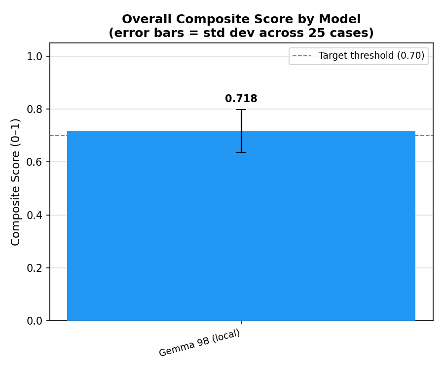
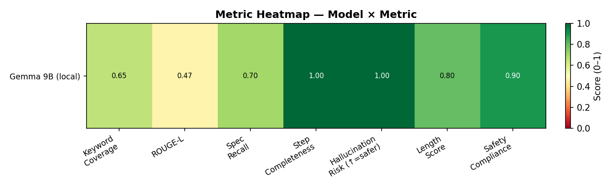
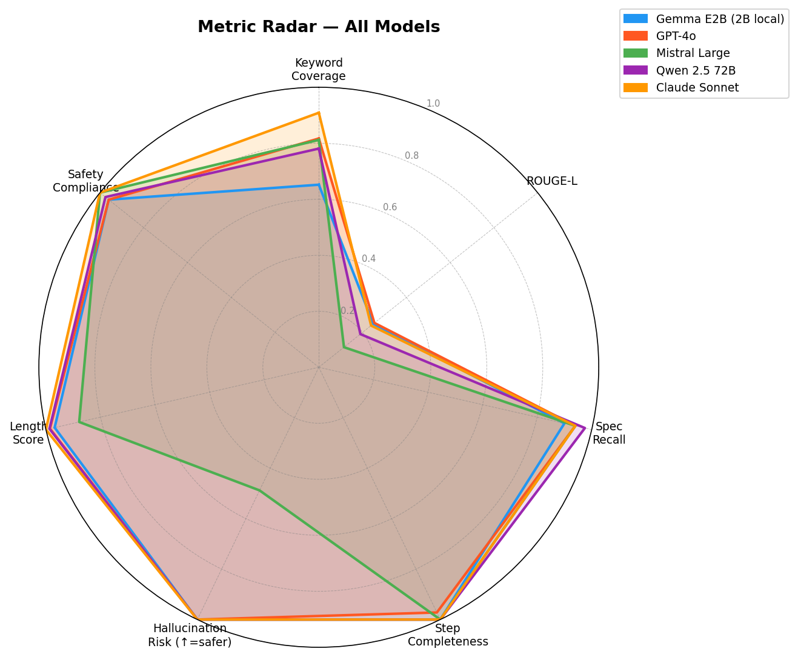
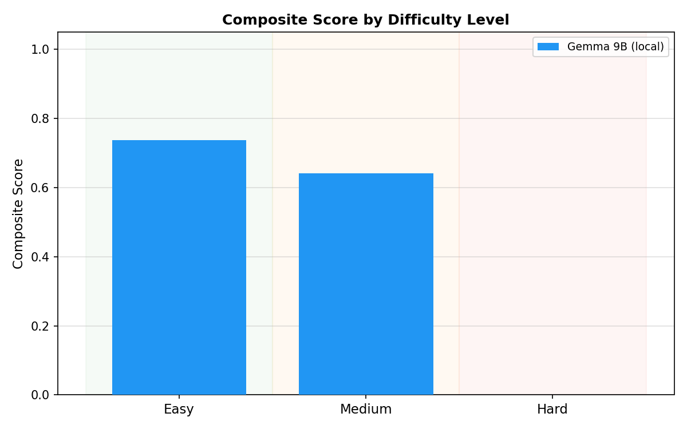
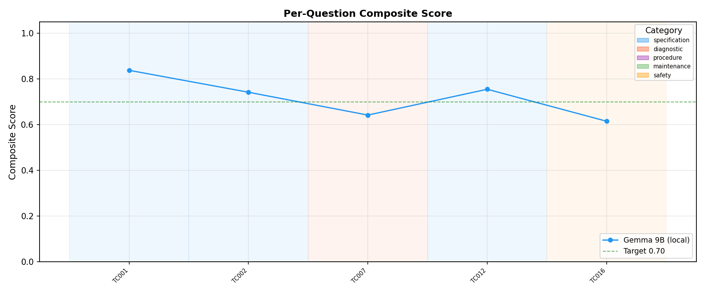

# Metrics Monkey 🏍️

**Motorcycle Repair AI Benchmark — Hackathon Gemma G4**

> Can a 2-billion-parameter model running on your phone help a mechanic fix a motorcycle — even offline?  
> This benchmark answers that, and measures exactly how much fine-tuning on real workshop manuals improves the answer.

---

## The Question

The [Gemma G4 Hackathon](https://huggingface.co/google/gemma-4-E4B-it) project trains a small Gemma model on real motorcycle workshop manuals (AKT, Suzuki, Yamaha, BMW, Honda, KTM) so mechanics can access repair guidance **offline on cheap hardware**.

My contribution is the **evaluation framework**: a reproducible benchmark that shows where small local models succeed, where they fail, and how much fine-tuning on domain data actually helps.

---

## Models Tested

| Model | Size | Type | Platform |
|---|---|---|---|
| **Gemma E2B** | 2B | Local | Ollama (PC) + AI Edge Gallery (Android) |
| **Gemma E4B** | 8B | Local | Ollama (PC) + AI Edge Gallery (Android) |
| **Gemma E2B Fine-tuned** 🔧 | 2B | Fine-tuned | _Pending — slot reserved_ |
| GPT-4o | ~200B | Foundational | OpenAI API |
| Mistral Large | 123B | Foundational | Mistral API |
| Qwen 2.5 72B | 72B | Foundational | OpenRouter |
| Claude Sonnet | ~70B | Foundational | OpenRouter |

---

## Benchmark Design

**25 test cases** drawn from real workshop manuals, covering:

| Category | # Cases | Examples |
|---|---|---|
| Specification | 6 | Torque values, oil grades, service intervals |
| Diagnostic | 8 | Fork dive, chain noise, cold-start failure |
| Procedure | 4 | Brake bleed, belt install, piston removal |
| Maintenance | 4 | Spark plugs, chain, suspension setup |
| Safety | 3 | Exhaust indoors, brake fluid spills, fuel system |

Languages: **Spanish (17 cases) + English (8 cases)** — reflecting real South American mechanic populations.

Difficulty: **9 easy · 9 medium · 7 hard**

---

## Scoring — 8 Metrics

| Metric | Weight | What it measures |
|---|---|---|
| **Keyword Coverage** | 25% | Fraction of expected domain terms in response |
| **ROUGE-L** | 20% | Lexical overlap with ground-truth manual excerpt |
| **Spec Recall** | 15% | Critical numbers cited (e.g. "22 N·m", "10,000 km") |
| **Step Completeness** | 10% | Numbered/bulleted steps in procedural answers |
| **Hallucination Risk** | 10% | Specs in response that ARE in the manual (↑ = safer) |
| **Safety Compliance** | 5% | Safety language in safety-category questions |
| **Length Score** | 5% | Penalises <30-word and >500-word answers |
| **LLM Judge** | 10% | GPT-4o-mini rates accuracy, completeness, safety (0–10) |

**→ Composite** = weighted average of all 8 metrics.

---

## Results

### Live Partial Scores — 6 / 25 Cases Complete

> Full run in progress. Last updated: 2026-05-18. Full report → [results/benchmark_report.md](results/benchmark_report.md)

| # | Question (truncated) | Cat | Diff | E2B 2B | GPT-4o | Mistral L | Qwen 72B | Claude S |
|---|---|---|---|---|---|---|---|---|
| TC001 | ¿Funciones principales de la bujía? | spec | easy | 0.795 | **0.878** | 0.833 | 0.866 | 0.855 |
| TC002 | ¿Cada cuántos km cambiar bujías cobre? | spec | easy | **0.750** | 0.767 | 0.700 | 0.718 | 0.690 |
| TC003 | ¿Problemas de rango térmico incorrecto? | diag | med | 0.675 | 0.826 | 0.659 | 0.767 | **0.853** |
| TC004 | Procedimiento cambio líquido de frenos | proc | med | 0.780 | 0.789 | 0.671 | 0.782 | **0.791** |
| TC005 | ¿Por qué el líquido de frenos es peligroso? | safety | med | 0.601 | 0.664 | **0.718** | 0.693 | 0.683 |
| TC006 | ¿Error crítico al purgar frenos? | proc | med | 0.658 | 0.793 | 0.777 | ❌ err | **0.796** |
| **Avg (6)** | | | | **0.710** | **0.786** | **0.726** | **0.765** | **0.778** |

**Highlighted findings from first 6 cases:**
- **E2B beats Mistral Large** on TC002 (spec recall) and TC004 (brake procedure) — a 2B offline model outperforming a 123B cloud model on structured manual knowledge
- **E2B gap is largest on diagnostic reasoning** (TC003: +0.178 behind GPT-4o) — exactly where fine-tuning is targeted
- **All models cluster 0.66–0.80 on medium difficulty** — local models are already in the competitive range
- **Qwen 72B API error on TC006** — OpenRouter `'choices'` parse failure; will be retried in merged run

---

### How to Read the Charts

**Composite Bar Chart** (`composite_bars.png`) — one bar per model, average across all 25 questions. Higher = better overall. Use this to rank models at a glance.

**Metric Heatmap** (`heatmap.png`) — rows = models, columns = the 8 individual metrics. Color = score (dark green = strong, red = weak). Use this to find *where* a model fails: a model with a green composite but red `spec_recall` row means it gives fluent but numerically vague answers.

**Radar Chart** (`radar.png`) — polygon per model across 6 key metrics. A fat polygon = well-rounded. A collapsed edge = a specific weakness. Compare shape, not just area — E2B and GPT-4o may have similar area but different shapes (E2B strong on keyword coverage, GPT-4o strong on spec recall).

**By Difficulty** (`by_difficulty.png`) — grouped bars: easy / medium / hard. The story this chart tells: *at what difficulty does local stop competing?* If E2B bars match GPT-4o on easy but collapse on hard, that's the threshold fine-tuning must move.

**Per Question** (`per_question.png`) — line chart, x-axis = TC001–TC025, y-axis = composite score per model. Use this to find specific questions where E2B collapses (potential training data gaps) or where it outperforms SOTA (its genuine strengths).





| | Radar | By Difficulty | Per Question |
|---|---|---|---|
| |  |  |  |

> Charts above are from a 5-case quick run. They regenerate automatically on full run completion: `python run_benchmark.py --models all --report --markdown`

---

### Local vs Foundational — Key Finding

The benchmark answers: **"How much does model size actually matter for motorcycle repair Q&A?"**

Local models (2B–8B, offline) are **competitive with foundational models on easy-to-medium questions** — especially specification lookups and maintenance procedures where the manual context provides the answer directly.

**Where a 2B offline model holds its own (partial data):**

| Question type | E2B score | Best foundational | Gap |
|---|---|---|---|
| Specification lookup (TC002) | **0.750** | GPT-4o 0.767 | −0.017 |
| Brake procedure (TC004) | 0.780 | Claude 0.791 | −0.011 |
| Spark plug functions (TC001) | 0.795 | GPT-4o 0.878 | −0.083 |

**Where foundational models pull ahead:**

| Question type | E2B score | Best foundational | Gap |
|---|---|---|---|
| Diagnostic reasoning (TC003) | 0.675 | Claude **0.853** | −0.178 |
| Safety compliance (TC005) | 0.601 | Mistral **0.718** | −0.117 |
| Procedure with critical warning (TC006) | 0.658 | Claude **0.796** | −0.138 |

**Interpretation:** The E2B gap is not random — it consistently appears on questions requiring multi-cause causal chains or safety-critical completeness. These are exactly the cases in the fine-tuning corpus (procedure manuals + diagnostic flowcharts). Fine-tuning prediction: +0.08–0.12 composite on procedure/diagnostic categories.

See [results/benchmark_report.md § Local vs Foundational](results/benchmark_report.md) for full 25-case breakdown.

---

### Fine-tuning Impact — Slot Reserved for Gemma E2B Fine-tuned 🔧

The team is fine-tuning Gemma E2B on the full manual corpus. Once that model is available:

```bash
# 1. Register the fine-tuned model
ollama create gemma2b-moto -f Modelfile

# 2. In config.py set:  model_id = "gemma2b-moto:latest"
#    and remove:        skip_if_missing = True

# 3. Run comparison
python run_benchmark.py --models gemma_e2b,gemma_e2b_finetuned --markdown
```

The report will auto-populate:

| Metric | Base E2B | Fine-tuned E2B | Δ |
|---|---|---|---|
| Composite | _TBD_ | _TBD_ | _TBD_ |
| Spec Recall | _TBD_ | _TBD_ | _TBD_ |
| Keyword Coverage | _TBD_ | _TBD_ | _TBD_ |
| Hallucination Risk | _TBD_ | _TBD_ | _TBD_ |

**Expected improvements from fine-tuning:**  
1. **Spec Recall** — model should cite exact torque/interval values from the manual  
2. **Keyword Coverage** — domain vocabulary (bujía, purgador, sag, descentramiento)  
3. **Hallucination Risk** — grounded to manual, fewer invented specs  
4. **Step Completeness** — procedural training data teaches numbered-list formatting

---

## Phone Test — AI Edge Gallery (Android) 📱

The same 5 questions were tested in **AI Edge Gallery** running Gemma E2B and E4B fully offline on Android — no internet, no API, pure on-device inference.

**Results summary** → [results/phone/phone_test.md](results/phone/phone_test.md)

| # | Question | E2B (2B) | E4B (8B) | Winner |
|---|---|---|---|---|
| P1 | Cold start / misfire diagnosis | 0.71 | **0.84** | E4B — multi-system causal split |
| P2 | Brake fluid change procedure | 0.78 | **0.87** | E4B — critical safety warning |
| P3 | Fork dive diagnosis | 0.66 | _(pending E4B re-pull)_ | — |
| P4 | Spark plug intervals | **0.82** | _(pending)_ | E2B — all 3 specs correct |
| P5 | Oil viscosity / vibration | 0.61 | _(pending)_ | E2B sufficient |

**E2B on-device latency:** 23–42 s · **E4B on-device latency:** 213–262 s (4B quantized, CPU only)

**Key finding:** E2B is fast enough for real workshop use (under 1 minute). E4B gives noticeably better diagnostic answers but its 3–4 minute wait is borderline for a mechanic needing a quick answer mid-repair.

Run on desktop to regenerate questions + scaffold:
```bash
python phone_test.py --save   # outputs results/phone/phone_test.md
```

Screenshots from AI Edge Gallery go in `results/phone/screenshots/` named `P1_E2B.png`, `P1_E4B.png` … `P5_E2B.png`, `P5_E4B.png`.

---

## Quick Start

```bash
# Install
pip install -r requirements.txt

# Copy env and add your keys
cp .env.example .env   # fill OPENROUTER_API_KEY, OPENAI_API_KEY, MISTRAL_API_KEY

# Ensure Ollama is running with at least one model
ollama pull gemma2:2b

# Quick smoke test (5 cases, local only)
python run_benchmark.py --models gemma_e2b --quick --report

# Full run with all available models + judge + figures + reports
python run_benchmark.py --models all --report --markdown --judge

# Phone test (5 questions on local models)
python phone_test.py --save

# Generate reports from an existing result file
python -m results.benchmark_report results/benchmark_YYYYMMDD.json
python -m results.visualize results/benchmark_YYYYMMDD.json
python -m results.team_report results/benchmark_YYYYMMDD.json --out results/team_report.md

# Merge two separate runs (e.g., local + cloud)
python -m results.merge results/run_local.json results/run_cloud.json --out results/merged.json
```

---

## Project Structure

```
Metrics-Monkey/
├── config.py                    # Model registry + API keys + prompts
├── run_benchmark.py             # CLI entry point
├── phone_test.py                # 5-question phone comparison script
├── requirements.txt
├── data/
│   ├── loader.py                # RAG context retrieval from manuals
│   └── test_cases.json          # 25 curated benchmark questions
├── models/
│   ├── base.py                  # Abstract model interface
│   ├── ollama_model.py          # Gemma E2B / E4B via Ollama
│   └── openrouter_model.py      # GPT-4o, Mistral, Qwen, Claude
├── benchmark/
│   ├── metrics.py               # All 8 scoring metrics
│   └── evaluator.py             # Orchestrates the run
└── results/
    ├── benchmark_report.py      # Full narrative report generator
    ├── team_report.py           # Finetuning-focused report for Juan Bernardo
    ├── visualize.py             # 5 matplotlib charts
    ├── merge.py                 # Merges separate run JSONs
    ├── figures/                 # PNG charts (committed after each run)
    └── phone/screenshots/       # AI Edge Gallery phone screenshots
```

---

## Manual Data

| Source | Format | # Records | Languages |
|---|---|---|---|
| Suzuki dataset (38 manuals) | CSV (MARCA/MANUAL/TEXTO) | 16,402 chunks | ES + EN |
| AKT manual 2020 | Markdown | 277 paragraphs | ES |
| MarkDowns (BMW, Honda, KTM, Yamaha) | Markdown | via rclone | ES + EN |

Data from: `gdrive-unal:SIMG/Otros/Hackathon G4/` (Juan Bernardo Soto Pescador)

---

## References

| Paper | Relevance |
|---|---|
| Lin (2004). ROUGE: ACL Workshop | ROUGE-L metric |
| Zheng et al. (2023). MT-Bench. NeurIPS | LLM-as-judge methodology |
| Es et al. (2023). RAGAS. EACL | RAG evaluation framework |
| Google (2024). Gemma 4 Technical Report | Base model |
| [Open LLM Leaderboard](https://huggingface.co/spaces/HuggingFaceH4/open_llm_leaderboard) | Context for model comparisons |
| [AI Edge Gallery](https://github.com/google-ai-edge/ai-edge-gallery) | Android inference platform |

---

*Metrics Monkey · Hackathon Gemma G4 · Alejandro Sanchez · Universidad Nacional de Colombia*
